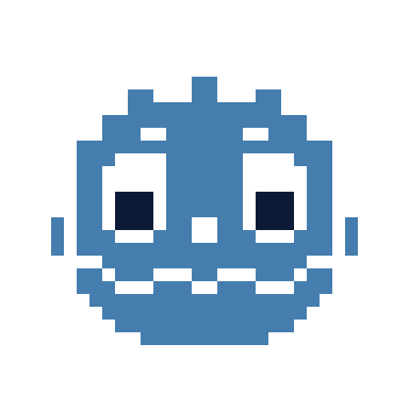
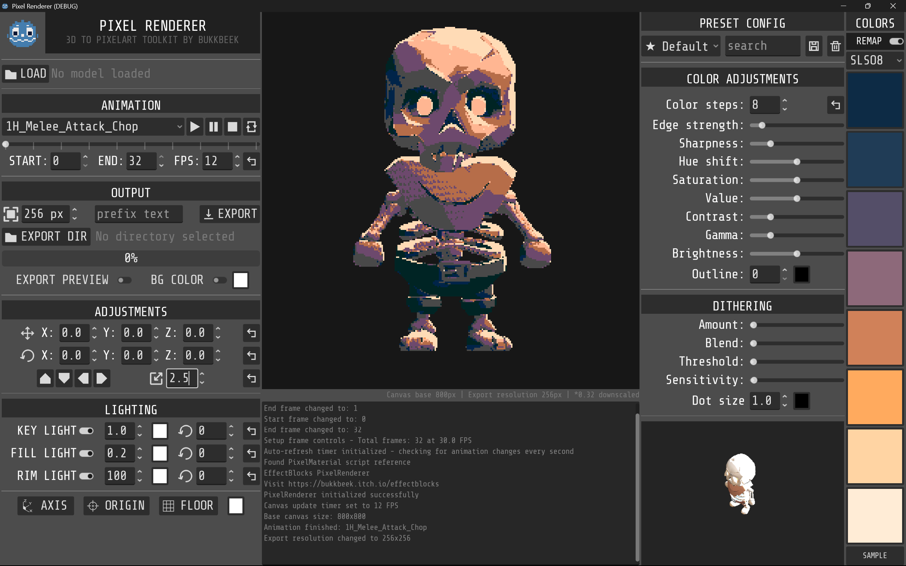

# Godot Pixel Renderer
### (Known as: Godot Pixel Studio)

<div align="center">
  
</div>

A powerful **3D to Pixel Art Renderer** built with Godot that exports 3D models and animations into retro-style pixel art with customizable effects and frame by frame animation export capabilities.


<div align="center">
  
</div>

---

**Watch GFS (Games From Scratch) review video on Youtube**

[](https://youtu.be/uRmB3MXzR_Q?si=s-mqPHxdC0RcUgZr)

## Developer

Created by **[bukkbeek](https://bukkbeek.github.io/)**. Visit [bukkbeek.github.io](https://bukkbeek.github.io/) for more details.

[](https://bukkbeek.github.io/)
[](https://bukkbeek.itch.io/)

## Downloads
### Get Pixel Renderer
[](https://github.com/bukkbeek/GodotPixelRenderer)
[](https://bukkbeek.itch.io/pixel-renderer)

[](https://aur.archlinux.org/packages/godot-pixel-renderer-git)

*Note: Arch Linux version is independently maintained*


## Features

### Pixel Art Rendering
- **Real-time 3D to pixel art conversion** with customizable pixelation (8-800 pixels)
- **Color quantization** with adjustable steps (2-32 colors) and 8-color palette support
- **Advanced shader effects**: edge detection, sharpening, dithering, and outlines
- **Post-processing controls**: HSV adjustments, contrast, gamma, and brightness
- **Specular and Normal map** export 

### Animation & Export
- **Frame-by-frame animation export** to PNG sequences with progress tracking
- **Flexible export settings**: custom frame ranges, variable FPS (1-120), resolution scaling
- **GLB/GLTF model support** with animation playback controls and auto-refresh detection


### User Experience
- **Intuitive interface** with organized control panels and real-time preview
- **Preset configurations** and console logging for detailed feedback
- **Export management** with custom paths, filename prefixes, and batch capabilities

<!-- Example Output GIFs -->
<div align="center" style="display: flex; gap: 16px; justify-content: center;">
  
  
</div>

## Quick Start

### Installation

1. **Clone and open:**
   ```bash
   git clone https://github.com/bukkbeek/GodotPixelRenderer.git
   cd GodotPixelRenderer
   ```

2. **Launch in Godot:**
   - Import `project.godot`
   - Press `F5` to run
   - Select `PixelRenderer/PixelRenderer.tscn` if prompted


### Basic Workflow
1. **Load Model**: Click `Load Model` and select GLB/GLTF file
2. **Configure Effects**: Adjust pixelation, colors, and shader parameters
3. **Set Camera**: Position and frame your model using camera controls
4. **Export**: Choose output directory, set frame range/FPS, and export PNG sequence

### Key Controls
- **Animation**: Play/pause/stop buttons with loop toggle and frame range selection
- **Camera**: XYZ positioning, rotation presets, and zoom controls
- **Effects**: Pixelation slider, color steps, palette mode, and post-processing
- **Export**: Directory selection, resolution scaling, and filename customization

## Technical Details

### Project structure
- **`PixelRenderer.gd`**: Main controller and export system
- **`models_handler.gd`**: 3D model positioning and camera controls
- **`models_spawner.gd`**: Model loading and animation management
- **`pixel_material.gd`**: Shader parameter management
- **`PixelArt.gdshader`**: Custom pixel art rendering with Sobel edge detection and Bayer dithering

### Export System
Captures animation frames using SubViewport rendering with real-time pixel art effects, nearest-neighbor scaling, and PNG output with transparency support.

## Contributing & Support

### Get Involved
- ★ *Star* this repository
- Report issues on [GitHub Issues](https://github.com/bukkbeek/GodotPixelRenderer/issues)
- Submit PRs and feature suggestions


## License

This project is licensed under the MIT License.

## Changelog

### v1.3 - April 29, 2026
- `Main` updated to Godot 4.6
- Static frame export by (by [Ignas](https://github.com/ignoxx))
- Minor updates to UI & tooltips

### v1.2 - August 15, 2025
- 360 rendering and variable resolution support (by [Slavaitis](https://github.com/Slavaitis))
- Gizmo location changed
- Link to GitHub repo added

### v1.1.1 - July 25, 2025
  - Normal maps rendering support (by [Viktor Edén](https://github.com/HolyAcorn))
  - Specular maps rendering support (by [Viktor Edén](https://github.com/HolyAcorn))
  - mode selection will automatically trigger color remap toggle

### v1.1 - July 23, 2025
  - Bug fix: animation rendering and export issues
  - Bug fix: background rendering problems
  - Bug fix: transparent background rendering

### v1.0 - July 22, 2025
- **Initial Release**
- *Note: This initial release contained several bugs that were addressed in subsequent updates*

## Acknowledgments

Thanks to the amzing **Godot** community, **Lospec** pixel art community, and **KayKit** for the default skeleton asset.


### AI Development assistance
This project was developed with the assistance of **Claude Sonnet** through **Cursor** as a coding assistant, helping to enhance development efficiency and code quality.
